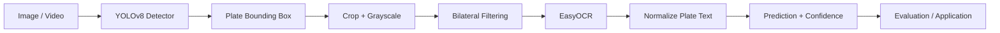

# ANPR Architecture

## Separation of concerns
**Detection** answers *where is the plate?* and should be evaluated with object-detection metrics such as precision, recall and mAP at defined IoU thresholds.

**Recognition** answers *what characters are on the plate?* and can be evaluated using exact-match accuracy and character-level edit-distance accuracy.

**End-to-end ANPR** succeeds only when both stages work. A detector can have strong mAP while the final plate text is still wrong because of blur, crop quality, glare or OCR confusion.

## Failure modes
- motion blur and low resolution
- severe plate angle/perspective
- glare, shadows and night lighting
- partial/occluded plates
- visually similar characters such as `0/O`, `1/I`, `5/S`, `8/B`
- false-positive detector boxes

## Production extensions
A production design could add perspective correction, temporal tracking/voting for video, country/state-specific format validation, batch inference, model versioning, latency monitoring, drift monitoring and privacy/retention controls.
